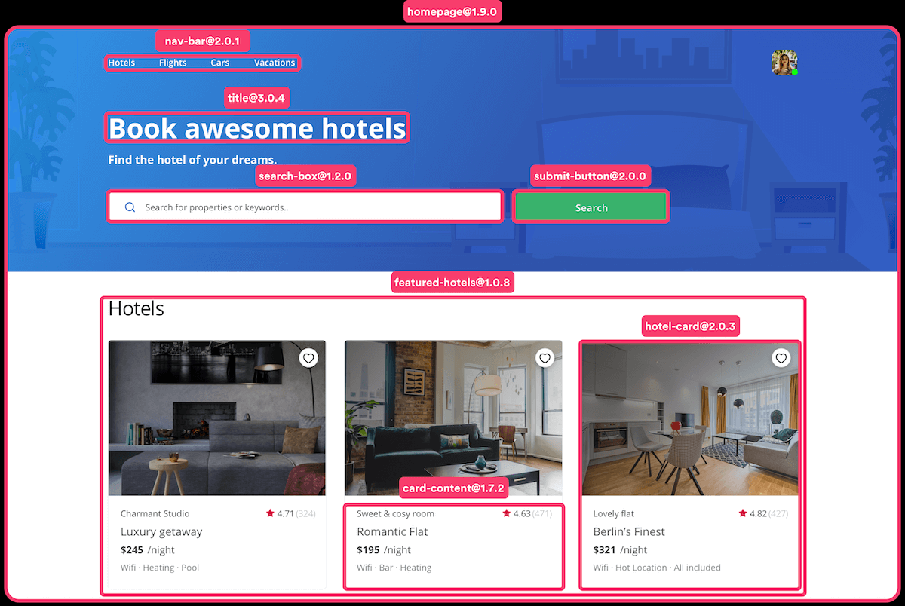

<center>

# Getting started with ReactJS

</center>

---

<!--
footer: 'Join the live Q&A using this code #65628 on https://sli.do'
-->

# Who am I ? 👀
- 🎓 ISI Ariana --> 🎓 INSAT Student
- 💻 Developer (Front-end, Back-end, Machine Learning, DevOps)
- Open-source developer

- **Developer** experience is as important as **user** experience

---

<center>

</center>

---


# What is ReactJS?
It's a front-end library that will make you love writing HTML and JS again.


---

# Why not everyone use it?
Because they are humlazyhum... I mean they find it a bit difficult to learn at first.

---

# How to create a React project?
Creating react projects is as easy as running a single command.
<div style="display:flex; width:100%; flex: 1 1 0px">
	<div style="width:100%">
		<h2>Prerequisites</h2>
		<ul>
			<li>NodeJS</li>
			<li>Yarn (not required)</li>
	</div>		
	<div style="width:100%">
		<h2>Installation</h2>
		
```bash
npx create-react-app <your-project-name-here>
```
For example:
```bash
npx create-react-app my-project
```

<div>
</div>

---

# Great News and bad news !

---
<center>

# Bad news
You won't be a professional React developer once you finish this session

</center>

---

<center>

# Good news
React will give you one tool (or two) to build your whole application.

</center>

--- 

# What's the motivation behind React?

---

<center>

</center>

---

# Let's create a simple component
Before that, let's write the HTML of our component in a separate file

<my-code data-name="App.js">

```html
<div>
	
	<h3>Barcelo</h3>
	<p>Morocco</p>
</div>
```

</my-code>

---

# Let's create a simple component
Now we create a function that returns that HTML. BOOM we created a component.

<my-code data-name="App.js">

```javascript
export default function 
<div>
	
</div>
```

</my-code>

---
<!--
_footer: ''
-->

# Thank you!
Happy to answer any of your questions!

**Feel free to reach me!**
- Github `@wassimbenzarti` 
- Linkedin `/in/wassim-benzarti/`

